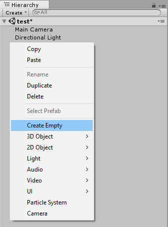
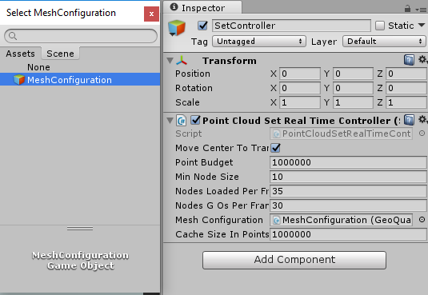
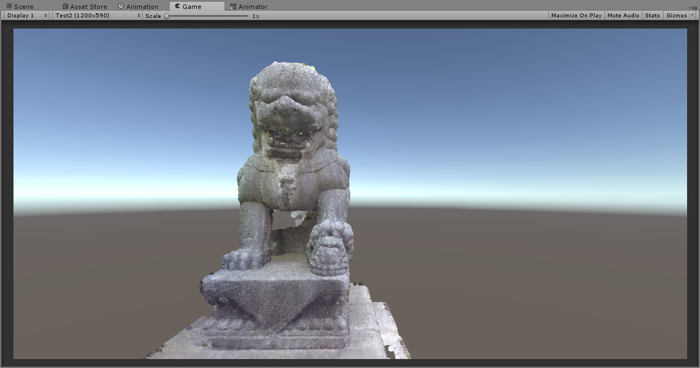

# BA_PointCloud
PointCloud-BachelorThesis

Project files for my bachelor thesis on rendering large point clouds in Unity.

## Ressources
Please refer to the code documentation for details about the classes and scripts (Folder "/doc").
For details about the algorithms please refer to the bachelor thesis (will be linked here soon).
Below you will find a Getting-Started-Guide

## Projects & Demo-Scenes:
* PointCloudRenderer: Main-Project.  
	This project is able to load a pointcloud in the Potree-format, as described in the bachelor thesis.
	
	There are currently three demo scenes:
	
	* Assets/Scenes/BigCloudScene.unity:
		In this example scene, all clouds from all folders in the folder "Clouds/big" are loaded.
	
	* Assets/Scenes/DemoScene.unity:
		In this example scene, four separate clouds are loaded.
	
	* Assets/Scenes/OneTimeScene.unity:
		In this example scene, one cloud is loaded at the beginning completely (without the lod-algorithms from the thesis).
		
	* Assets/Scenes/RenderTestScene.unity:
		In this scene, only 12 points are rendered in order to test the correct rendering.
		
	Moving around can be done using the WASD-keys as well as EQ for moving up and down, LeftShift for moving with higher speed and C for moving with lower speed.
	  
* Tests: Used to test several classes in the other projects.

## Getting Started
Here's a short tutorial on how to display your own cloud in the project.
1. If your point cloud is not in the Potree format yet, you first have to convert it. Head over to https://github.com/potree/PotreeConverter/releases, download the PotreeConverter and convert your cloud into the Potree format.
2. Open the project "PointCloudRenderer" in Unity. Go to "File"->"New Scene" to create a new scene. Press Crtl+S to save it (prefferably in the Scenes-folder).
3. If you want to be able to navigate the camera through the scene, select the Main Camera in the Scene Graph and press "Add Component" in the Inspector. Choose "Scripts"->"Controllers"->"Camera Controllers". When you start the game, you can then move the camera around by using the mouse and the WASD-keys as well as EQ for moving up and down, LeftShift for moving with higher speed and C for moving with lower speed. You can set the normal speed in the Inspector.
4. Let's create a MeshConfiguration. This will determine how the point cloud will be rendered. Right click in the Scene Graph and select "Create Empty". Name this object "MeshConfiguration" or something similar. Press "Add Component" in the Inspector and select "Scripts"->"Object Creation". Here three different Configurations are available. These are the three different approaches described in the thesis ("PointMeshConfiguration" is Single-Pixel Point Rendering, "Quad4PointMeshConfiguration" is 4-Vertex Quad Rendering and "GeoQuadMeshConfiguration" is Geometry Shader Quad Rendering). Usually, GeoQuadMeshConfiguration is the best choice. You can then change the settings of the Configuration, such as the point radius, whether to use circles or squares, whether to use screen size or world size and what kind of interpolation to use. If "Reloading Possible" is checked, you can adapt the options while the application is running and then select "Reload" to submit your changes.

 

5. The next thing to do is creating a PointSetController. This will enable you to set options like point budget or min node size for all clouds in the scene. So create a new Empty in the Scene Graph and press the "Add Component"-button. Select "Scripts"->"Controllers"->"Point Cloud Set Real Time Controller" (alternatively you can also attach this script to the already existing MeshConfiguration-Object). Now you can adapt settings like point budget, min node size and cache size. To choose a MeshConfiguration, press the small circle next to the input field and select your previously created MeshConfiguration-object. Alternatively, you can also drag that object from the scene graph and drop it into the input field. If "Move Center to Transform" is enabled, the center of the point clouds will be set to the the position specified in the Transform-Component of this object (0/0/0 is default).

6. Create a Point Cloud object:
    * To display a single point cloud, create a new Empty object and attach the Component "Scripts"->"Controllers"->"Dynamic Loader Controller". In the input field "Cloud Path" enter the path to the point cloud folder in which the cloud.js file lies. This can either be a relative path from the "PointCloudRenderer"-directory (such as "Clouds\Lion\") or an absolute path. For choocing a "Set Controller" click on the circle next to the input field and select your previously created PointSetController.
    * If you have several point clouds you want to render, you can put all their folders in to the same directory and instead of creating a "Dynamic Loader Controller" you can create a "Scripts"->"Controllers"->"Clouds From Directory Loader". At "Path" enter the path to the directory containing the cloud-folders (such as "Clouds\big\"). For choocing a "Set Controller" click on the circle next to the input field and select your previously created PointSetController.

7. Press the Play-Button!

